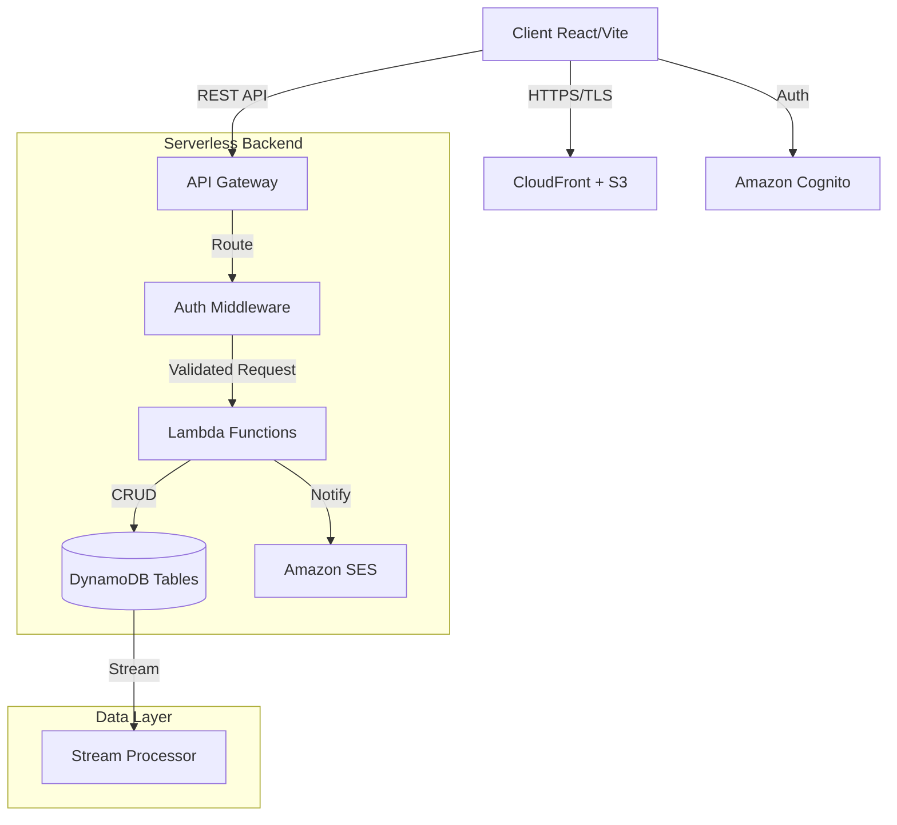

# DocAppoint - Serverless Application


A cloud-native patient and appointment management system architected on
**AWS Lambda** and **DynamoDB**.\
This project demonstrates a fully serverless approach to building
scalable, high-availability healthcare applications with near-zero idle
costs.

------------------------------------------------------------------------

## Table of Contents

1.  [System Architecture](#-system-architecture)
2.  [Technology Stack](#-technology-stack)
3.  [Local Development Setup](#-local-development-setup)
4.  [Deployment Strategy](#-deployment-strategy)
5.  [Security & Features](#-security--features)

------------------------------------------------------------------------


## System Architecture

The application follows a **Microservices-based Event-Driven Architecture**. The frontend is fully decoupled from the backend and served via a global CDN, while backend logic is split into granular AWS Lambda functions.

### Infrastructure Diagram


### Key Architectural Decisions

-   **Compute:** AWS Lambda (Node.js 18.x) for on-demand scalability and
    cost optimization.
-   **Database:** DynamoDB with single-table design principles (where
    applicable) for sub-millisecond latency.
-   **Authentication:** AWS Cognito for secure identity management,
    RBAC, and JWT handling.
-   **Infrastructure as Code:** Serverless Framework for declarative
    provisioning via CloudFormation.

------------------------------------------------------------------------

## Technology Stack

### Frontend

-   **Core:** React 18, Vite
-   **State Management:** Redux Toolkit (RTK) + Thunks
-   **Routing:** React Router v6 (Protected Routes via HOCs)
-   **Styling:** Tailwind CSS (Utility-first)

### Backend

-   **Runtime:** Node.js 18.x\
-   **Framework:** Serverless Framework v3
-   **Storage:** Amazon DynamoDB (NoSQL)
-   **API:** AWS API Gateway (REST)

### DevOps & Cloud

-   **CI/CD:** Manual triggers (adaptable to GitHub Actions)
-   **CDN:** AWS CloudFront backed by S3
-   **Monitoring:** AWS CloudWatch (Logs & Metrics)

------------------------------------------------------------------------

## Local Development Setup

### Prerequisites

-   Node.js \>= 18.x
-   AWS CLI (configured using `aws configure`)
-   Serverless Framework

``` bash
npm install -g serverless
```

------------------------------------------------------------------------

### 1. Clone & Install Dependencies

``` bash
git clone https://github.com/mohith0407/aws-healthcare-app.git
cd aws-healthcare-app

# Backend
cd backend && npm install

# Frontend
cd ../frontend && npm install
```

------------------------------------------------------------------------

### 2. Environment Configuration

Create a `.env` file in `frontend/`

``` env
VITE_AWS_REGION=ap-south-1
VITE_API_URL=https://[api-id].execute-api.ap-south-1.amazonaws.com/dev
VITE_COGNITO_USER_POOL_ID=[Region]_[PoolID]
VITE_COGNITO_CLIENT_ID=[WebClientId]
```

------------------------------------------------------------------------

### 3. Run Locally

``` bash
# Frontend
npm run dev

# Backend (API Gateway + Lambda emulation)
serverless deploy
```

------------------------------------------------------------------------

## Deployment Strategy

Infrastructure is provisioned using **CloudFormation templates**
generated by the Serverless Framework.

### Backend Deployment

``` bash
cd backend

# Full deployment (Dev stage)
serverless deploy --stage dev

# Deploy a single function (fast update)
serverless deploy function -f bookAppointment
```

------------------------------------------------------------------------

### Frontend Deployment

``` bash
cd frontend

# Build production assets
npm run build

# Sync build output to S3
aws s3 sync dist/ s3://[your-bucket-name] --delete
```

------------------------------------------------------------------------

## Security & Features

### Core Capabilities

-   **Multi-Tenancy:** Role-Based Access Control (RBAC) for Admin,
    Doctor, and Patient roles.
-   **Concurrency Handling:** Transactional DynamoDB logic prevents
    appointment double-booking.
-   **Optimistic UI:** Frontend updates instantly while syncing with
    backend state.

### Security Implementation

-   **Identity:** AWS Cognito User Pools with optional MFA.
-   **API Security:** All endpoints protected via Cognito Authorizers
    with JWT validation.
-   **Least Privilege:** IAM roles scoped strictly to required DynamoDB
    tables and SES resources.
-   **Encryption:**
    -   In transit: TLS 1.2+
    -   At rest: DynamoDB default encryption

------------------------------------------------------------------------

## License

This project is licensed under the [MIT License](LICENSE) - see the [LICENSE](LICENSE) file for details.

------------------------------------------------------------------------

## Author

**Mohith** -- Enthusiactic Software Developer\
Focused on scalable cloud-native and serverless architectures.
